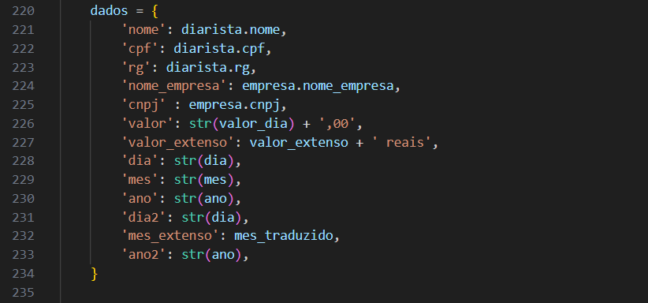

# *Gerador de Recibos Automático*
Este projeto é um gerador de recibos automático que preenche dados em um PDF pré-modelado. A ideia principal é facilitar a geração de recibos com informações dinâmicas, preenchendo um formulário já existente em um modelo de PDF.

## 📋 Funcionalidades
Preenchimento automático de campos em um PDF previamente formatado.
Geração rápida e eficiente de recibos personalizados.
Suporte para qualquer modelo de recibo em formato PDF que contenha campos de formulário editáveis.

## 🚀 Como utilizar
Para usar o projeto corretamente, siga as etapas abaixo:

### 1. Clone o repositório
Primeiramente, faça o clone deste repositório para sua máquina local:

bash  
Copiar código  
git clone https://github.com/ChristopherKevin7/Interface-de-cadastro-de-diaristas.git

### 2. Instale as dependências
Entre na pasta do projeto e instale as dependências necessárias. Você pode usar um ambiente virtual (como venv) ou simplesmente instalar globalmente:

bash  
Copiar código  
pip install -r requirements.txt

### 3. Prepare o modelo de recibo
Para utilizar o gerador, você precisa criar uma pasta chamada PDF_Modelo na raiz do projeto. Dentro dessa pasta, insira o modelo de recibo em formato PDF. Esse PDF deve conter os campos de formulário onde os dados serão inseridos automaticamente.

bash
Copiar código
app_cad_diarista/  
├── PDF_Modelo/  
│   └── modelo_de_recibo.pdf

### 4. Formato do PDF
O PDF que será utilizado como modelo deve conter campos de formulário que correspondam às informações que você deseja preencher automaticamente. Certifique-se de que os campos no PDF estão bem definidos para que o código possa acessá-los e preencher corretamente.

Aqui está uma imagem do trecho de código que identifica e preenche os campos no PDF:

### 5. Execução do Projeto
Depois que o modelo de recibo estiver na pasta correta, você pode executar o script para gerar os recibos. Dependendo de como o script foi configurado, você pode simplesmente rodar o comando abaixo:

bash  
Copiar código  
 python .\manage.py runserver
O script irá preencher o modelo de recibo com as informações definidas no código e salvará o recibo preenchido.

## 🛠 Tecnologias Utilizadas
Python: Linguagem principal do projeto.
Django: Framework para aplicações web.
PyPDF2: Para manipulação de arquivos PDF.

